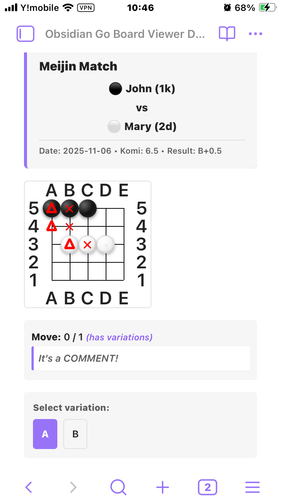
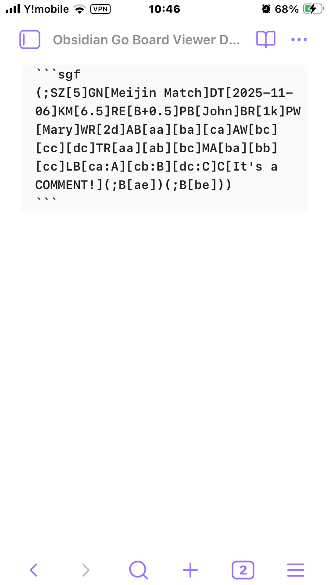

# Obsidian Go Board Viewer

SGF（Smart Game Format）ファイルやコードブロックを、再生機能付きのインタラクティブな碁盤として表示するObsidianプラグインです。

**📱 デスクトップとモバイルの両方で動作** - このプラグインはデスクトップとiOSとAndroidのモバイルをサポートしています。

[English version](./README.md)

## 機能

### 主要機能
- **📱 モバイル・デスクトップ対応**: iOS、Android、Windows、Mac、Linuxで完全に動作
- **SGFコードブロック対応**: ````sgf`コードブロック内のSGFテキストを自動的に碁盤として描画
- **SGFファイル埋め込み対応**: `![[game.sgf]]`構文で`.sgf`ファイルを表示
- **直接ファイルを開く**: `.sgf`ファイルをObsidian内で直接開いて表示
- **対局情報の表示**: 対局者名、棋力、棋戦名、日付、コミ、置石、結果を表示

### 再生・ナビゲーション
- **再生コントロール**: 最初/前/次/最後のボタンで棋譜を再生
- **手のコメント表示**: 各手に関連付けられたコメントを表示
- **変化図対応**: 複数の変化図を処理し、選択可能

### SGF機能
- **SGFマーカー**: SGFマークアッププロパティを完全サポート：
  - **LB**（ラベル）: 交点上のテキストラベル
  - **TR**（三角）: 三角マーカー
  - **SQ**（四角）: 四角マーカー
  - **CR**（円）: 円マーカー
  - **MA**（マーク）: バツ印マーカー
- **配置石**: AB（黒石配置）、AW（白石配置）、AE（空点）をサポート
- **複数の盤サイズ**: 19路盤、13路盤、9路盤、カスタムサイズ対応

### デザイン
- **レスポンシブデザイン**: 様々な画面サイズに対応 - スマホやタブレットでの棋譜研究に最適
- **タッチ操作対応**: モバイルデバイス向けに最適化されたボタンサイズとレイアウト

## スクリーンショット

### 基本的な棋譜表示


### ソース表示


## インストール方法

### 手動インストール

1. [Releasesページ](https://github.com/j2masamitu/obsidian-goboard-viewer/releases)から最新版をダウンロード
2. ファイルをObsidian vaultの`.obsidian/plugins/goboard-viewer/`ディレクトリに展開
3. Obsidianの設定 → コミュニティプラグインでプラグインを有効化

**同期プラグインを使用しているモバイルユーザーへの注意**：
- 「Remotely Save」などの同期プラグインを使用している場合、プラグインをモバイルデバイスに同期するには一時的に「Sync Config Dir」を有効にする必要があります
- 手順：
  1. 同期プラグインの設定で「Sync Config Dir」を有効化
  2. 同期を実行して完了を待つ
  3. モバイルデバイスでプラグインが表示されることを確認
  4. インストール完了後、「Sync Config Dir」を無効に戻しても構いません
- **重要**: プラグインを新しいバージョンに更新する際は、再度「Sync Config Dir」を有効にして同期する必要があります

### ソースからビルド

1. このリポジトリをクローン
2. 依存関係をインストール: `npm install`
3. プラグインをビルド: `npm run build`
4. 以下のファイルを`.obsidian/plugins/goboard-viewer/`にコピー:
   - `manifest.json`
   - `main.js`
   - `styles.css`
5. Obsidianの設定でプラグインを有効化

### 開発モード

```bash
npm install
npm run dev
```

開発モードでは、ファイルの変更を監視して自動的に再ビルドします。

## 使い方

### 方法1: SGFコードブロック

マークダウンノートにSGFコードブロックを追加:

````markdown
```sgf
(;SZ[19];B[pd]C[初手は星];W[dp];
B[qp];W[dc];B[nq]
;W[qc]C[ダイレクト三々])
```
````

### 方法2: SGFファイルの埋め込み

1. vaultに`.sgf`ファイルを追加
2. ノートに埋め込み:

```markdown
![[my-game.sgf]]
```

### マーカーの使用

SGFマーカーは赤色（変化図は青色）で表示されます:

```sgf
(;SZ[9]AB[aa][ba][ca][da][ea]AW[ac][bc][cc][dc][ec]TR[aa][ab][ac]SQ[ba][bb][bc]MA[ca][cb][cc]CR[da][db][dc]LB[ea:1][eb:2][ec:3])
```

- **TR**: 赤い三角 ▲
- **MA**: 赤いバツ印 ✕
- **SQ**: 赤い四角 □
- **CR**: 赤い円 ○
- **LB**: 赤いテキストラベル
- **変化図マーカー**: 青い文字（A、B、C...）

### 変化図の処理

局面に複数の変化がある場合、プラグインは以下を表示します:
- 盤上の青い文字マーカー（A、B、C...）で各変化の開始位置を表示
- 盤の下に変化選択ボタンを表示
- 手数の横に「(has variations)」インジケーターを表示

変化ボタンをクリックして分岐を切り替えます。

## SGF例

### シンプルな対局

```sgf
(;GM[1]FF[4]SZ[19]KM[6.5]DT[2025-11-08];B[pd]C[星];W[dp];B[pp];W[dd];B[fq];W[qq]C[ダイレクト三々];B[pq];W[qp];B[po];W[rn];B[cf];W[cn];B[fc];W[df];B[dg];W[ef];B[cd];W[cc];B[ce];W[dc];B[hc])
```

### 変化図のある棋譜

```sgf
(;GM[1]FF[4]SZ[19]KM[6.5]DT[2025-11-08];B[pd]C[星];W[dp];B[pp];W[dd];B[fq](;W[qq]C[ダイレクト三々];B[pq];W[qp];B[po];W[rn];B[cf];W[cn];B[fc];W[df];B[dg];W[ef];B[cd];W[cc];B[ce];W[dc];B[hc])(;W[cn]C[ケイマ受け];B[dq];W[cq];B[cr]))
```

### 配置石のある詰碁

```sgf
(;SZ[9]AW[ab][bb][cb][db][da]AB[ec][dc][cc][bc][ac][eb][ea]C[黒先白死];B[ba]C[三目ナカデ])
```

## 技術詳細

- **@sabaki/shudan**: 碁盤描画ライブラリ
- **@sabaki/sgf**: SGFファイル解析
- **Preact**: 軽量UI描画
- **Obsidian API**: MarkdownPostProcessorとMarkdownCodeBlockProcessor
- **オフライン**: インターネット接続不要で動作

## 対応SGFプロパティ

### 対局情報
- FF（ファイル形式）、GM（ゲーム）、SZ（サイズ）
- PB（黒のプレイヤー）、PW（白のプレイヤー）
- BR（黒の棋力）、WR（白の棋力）
- KM（コミ）、HA（置石）、RU（ルール）
- DT（日付）、GN（対局名）、EV（イベント）、RO（ラウンド）、PC（場所）
- RE（結果）

### 手と配置
- B（黒の着手）、W（白の着手）
- AB（黒石配置）、AW（白石配置）、AE（空点）
- C（コメント）

### マークアップ
- TR（三角）、SQ（四角）、CR（円）
- MA（マーク/バツ）、LB（ラベル）

### 変化図
- ゲームツリーの変化を完全サポート、選択UI付き

## 既知の制限

- 棋譜編集機能なし（閲覧のみ）
- 時間情報（BL、WL）は表示されません
- 一部の高度なSGFプロパティは完全にサポートされていない場合があります

## 貢献

貢献を歓迎します！IssueやPull Requestをお気軽に送ってください。

1. リポジトリをフォーク
2. フィーチャーブランチを作成: `git checkout -b feature/my-feature`
3. 変更をコミット: `git commit -am 'Add some feature'`
4. ブランチにプッシュ: `git push origin feature/my-feature`
5. Pull Requestを送信

## ライセンス

MIT License - 詳細は[LICENSE](LICENSE)ファイルを参照

## 謝辞

- [Sabaki](https://github.com/SabakiHQ/Sabaki) - 碁盤描画ライブラリ
- [SGF File Format](https://www.red-bean.com/sgf/) - 標準仕様
- [Obsidian](https://obsidian.md/) - ナレッジベースプラットフォーム

## リンク

- [GitHubリポジトリ](https://github.com/j2masamitu/obsidian-goboard-viewer)
- [Issue Tracker](https://github.com/j2masamitu/obsidian-goboard-viewer/issues)
- [Obsidianプラグインドキュメント](https://docs.obsidian.md/Plugins/Getting+started/Build+a+plugin)
